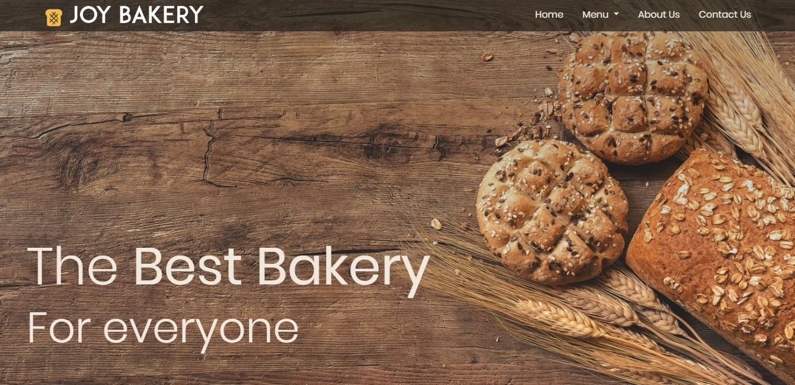

# JoyBakery

## Table of contents

- [Introduction](#introduction)
- [Demo](#demo)
- [Color Palette](#colors)
- [License](#license)

## Introduction

A static bakery website using HTML, CSS, SASS, Javascript, and jQuery.

## Demo

The website is deployed to netlify and can be viewed on the following link:

[JoyBakery on Netlify](https://joybakery.netlify.app/)

## Colors

Below is the color palette used in this application.

-  `#f0e8dd`
-  `#bf9872`
-  `#a86a47`
-  `#724732`
-  `#473e32`
-  `#241f19`

## License

- MIT License
- Copyright 2020 © [Maryam Aljanabi](https://github.com/maryamaljanabi)
